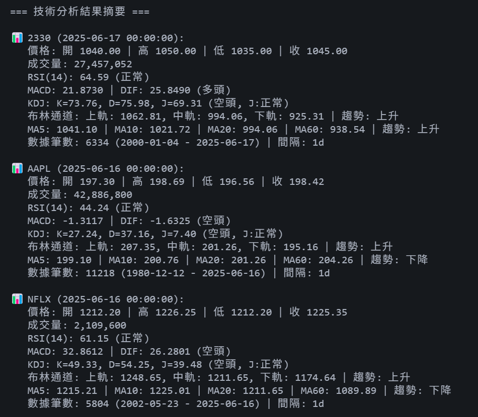

# 技術指標分析工具 (Technical Indicators)

[](https://github.com/HaoXun97/technical-indicators/actions/workflows/python-app.yml)

一個專業的股票技術分析工具，使用 Python 實現多種技術指標計算與分析，支援台股數據獲取與自動化分析。

## 🚀 功能特色

- **多種技術指標支援**：RSI、MACD、KDJ、移動平均線、布林通道等
- **台股數據支援**：自動格式化台股代號，支援 `.TW` 和 `.TWO` 市場
- **靈活的時間設定**：支援多種時間週期和間隔設定
- **結果輸出**：支援 JSON 和 CSV 格式輸出
- **完整測試覆蓋**：包含單元測試和整合測試
- **CI/CD 整合**：GitHub Actions 自動化測試

## 📱 輸出預覽

### 終端機執行



## 📋 支援的技術指標

### 趨勢指標

- **RSI (相對強弱指標)**：5、7、10、14、21 週期
- **MACD**：DIF、MACD、MACD 柱狀圖
- **移動平均線**：MA5、MA10、MA20、MA60
- **指數移動平均**：EMA12、EMA26

### 震盪指標

- **KDJ 指標**：K 值、D 值、J 值、RSV
- **CCI (商品通道指數)**
- **Williams %R**
- **動量指標 (MOM)**

### 波動性指標

- **布林通道**：上軌、中軌、下軌
- **ATR (平均真實範圍)**

## 🛠️ 安裝需求

```bash
pip install -r requirements.txt
```

### TA-Lib 安裝

#### Windows

Windows 安裝 TA-Lib 時可能會出現問題，請跟著以下步驟來安裝

1. 下載預編譯的 wheel 檔案：[前往下載](https://github.com/cgohlke/talib-build/releases/latest)

2. 請參考說明進行安裝：[安裝說明](https://github.com/cgohlke/talib-build)

3. 再次執行

```bash
pip install -r requirements.txt
```

#### macOS/Linux

```bash
# 安裝依賴
brew install ta-lib  # macOS
# 或
sudo apt-get install libta-lib-dev  # Ubuntu

pip install TA-Lib
```

## 💻 用法

### 命令列介面 (CLI)

直接從終端機執行 `Indicators.py`

```bash
python Indicators.py 2330 AAPL NFLX
```

這將會分析指定的股票代號 (2330, AAPL 和 NFLX)，並將結果儲存到 `output` 目錄中。

## 📊 輸出格式

### JSON 格式

```json
{
  "2330": {
    "symbol": "2330",
    "date": "2025-05-29 00:00:00",
    "price": {
      "open": 986.0,
      "high": 986.0,
      "low": 967.0,
      "close": 975.0,
      "volume": 15334906
    },
    "indicators": {
      "RSI(14)": 56.13,
      "MACD": 17.21,
      "K": 30.99,
      "D": 41.43,
      "MA20": 966.0
      其他指標...
    }
  }
}
```

### CSV 格式

包含完整的歷史數據和所有技術指標，適合進一步分析和視覺化。

## 🏗️ 專案結構

```
技術指標 Technical-indicators/
├── Indicators.py          # 主要程式檔案
├── test_indicators.py     # Python 測試檔案
├── requirements.txt       # 依賴套件
├── pytest.ini             # 測試配置
├── README.md              # 說明文件
├── images/                # 預覽圖片等資源
├── output/                # 輸出目錄
│   ├── analysis.json      # 分析結果
│   └── *.csv              # 歷史數據
└── .github/               # GitHub Actions 等設定
    └── workflows/
        └── python-app.yml   # GitHub Actions 配置
```

## 🧪 測試

```bash
# 執行所有測試
pytest

# 執行特定測試類別
pytest test_indicators.py::TestIndicatorCalculator

# 執行測試並顯示覆蓋率
pytest --cov=Indicators

# 執行測試並生成詳細報告
pytest -v --tb=short

# 執行測試並顯示覆蓋率
pytest test_indicators.py --cov=Indicators --cov-report=html
```

## 📈 支援的時間設定

### 時間週期 (Period)

- `DAY_1`: 1 天
- `DAY_5`: 5 天
- `MONTH_1`: 1 個月
- `MONTH_3`: 3 個月
- `MONTH_6`: 6 個月
- `YEAR_1`: 1 年
- `YEAR_2`: 2 年
- `YEAR_5`: 5 年
- `YEAR_10`: 10 年
- `MAX`: 最大可用期間

### 時間間隔 (TimeInterval)

- `MINUTE_1`: 1 分鐘
- `MINUTE_5`: 5 分鐘
- `MINUTE_15`: 15 分鐘
- `MINUTE_30`: 30 分鐘
- `HOUR_1`: 1 小時
- `DAY_1`: 1 天
- `WEEK_1`: 1 週
- `MONTH_1`: 1 個月

## 🐛 常見問題

### Q: 為什麼某些指標顯示 NaN？

A: 技術指標需要足夠的歷史數據才能計算。建議使用至少 60 個交易日的數據。

### Q: 如何處理台股代號格式？

A: 系統會自動將純數字代號（如 "2330"）轉換為 Yahoo Finance 格式（"2330.TW"）。

### Q: 可以分析美股嗎？

A: 可以，直接使用美股代號（如 "AAPL"），系統會自動識別。

### Q: 如何自定義輸出目錄？

A: 在創建 TechnicalAnalyzer 時指定：`analyzer = TechnicalAnalyzer("custom_output")`
